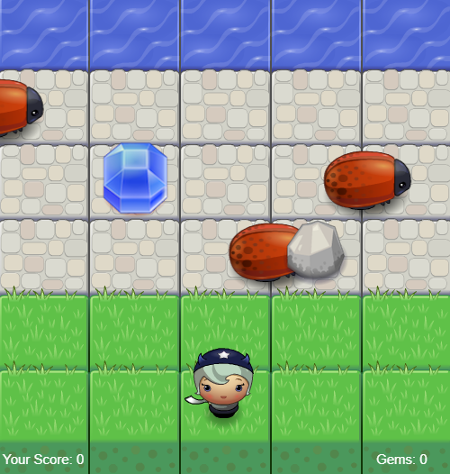

# Frogger Type Game

Welcome to the javascript Frogger type game project! This project is a simple implementation of the classic Frogger type game using JavaScript, HTML, and CSS. The goal is to navigate the player across the board while avoiding enemies and collecting gems.

Screenshot of the game:

<p align="center">
  
</p>

## Table of Contents

- [Frogger Type Game](#frogger-type-game)
  - [Table of Contents](#table-of-contents)
  - [Introduction](#introduction)
  - [Game Rules](#game-rules)
  - [Installation](#installation)
  - [File Structure](#file-structure)

## Introduction

This project demonstrates how to create a simple game using JavaScript, HTML, and CSS. It includes basic game mechanics such as player movement, enemy collision, and collectible items.

## Game Rules

- Use the arrow keys to move the player.
- Avoid enemies (bugs) to prevent losing lives.
- Collect gems for extra points.
- Reach the water at the top of the board to score points.
- The game ends if the player loses all lives.

## Installation

To run this game locally, follow these steps:

1. Clone the repository:

```bash
git clone https://github.com/alvaro347/frogger-type-game.git
```

2. Navigate to the project directory:

```bash
cd frogger-type-game
```

3. Open the `index.html` file in your browser to start the game.

## File Structure


```bash
frogger-type-game/
├── css/
│   └── style.css        # Styles for the game
├── images/
│   └── *.png            # Game assets (sprites)
├── js/
│   ├── app.js           # Game logic
│   ├── engine.js        # Game engine
│   └── resources.js     # Resource loader
├── index.html           # Main HTML file
└── README.md            # Project documentation
```
